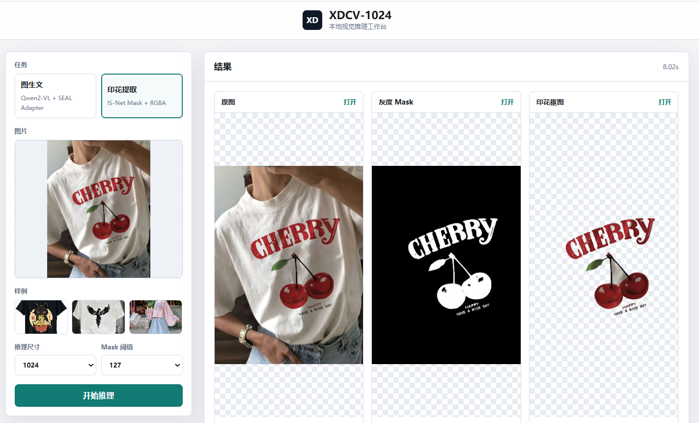
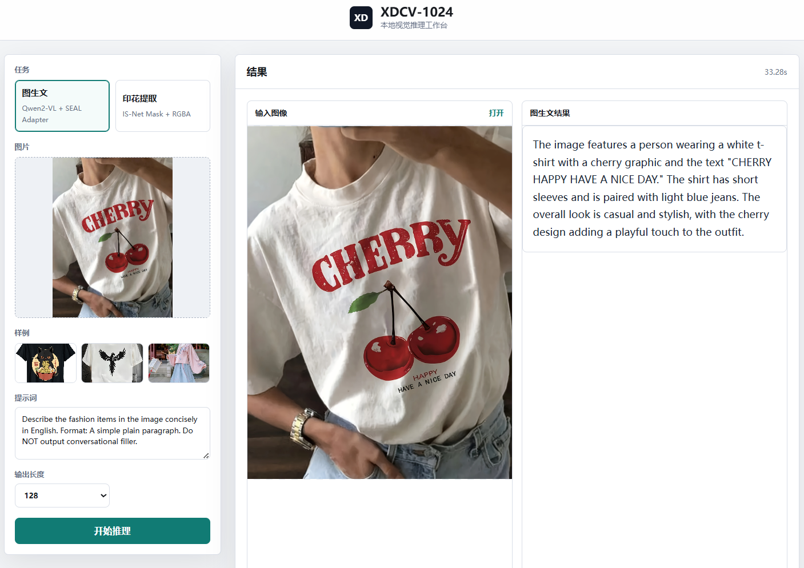
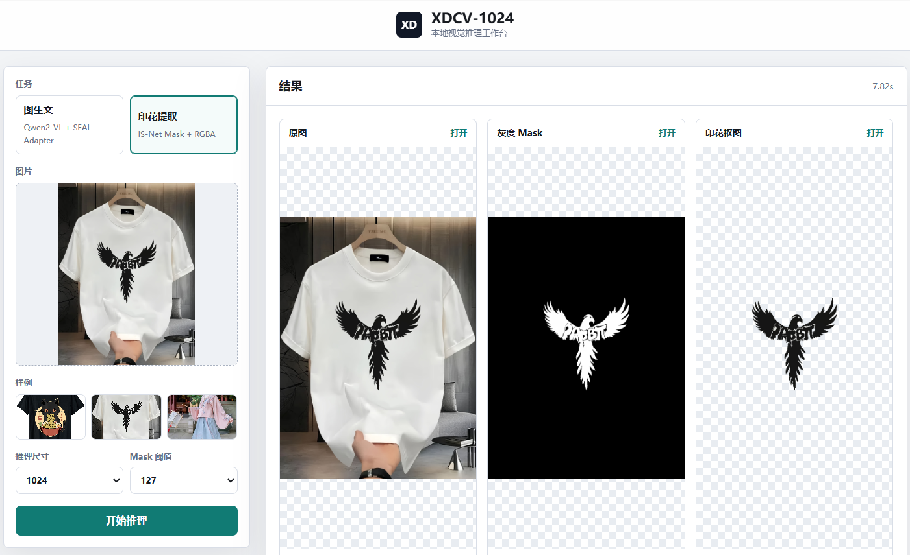
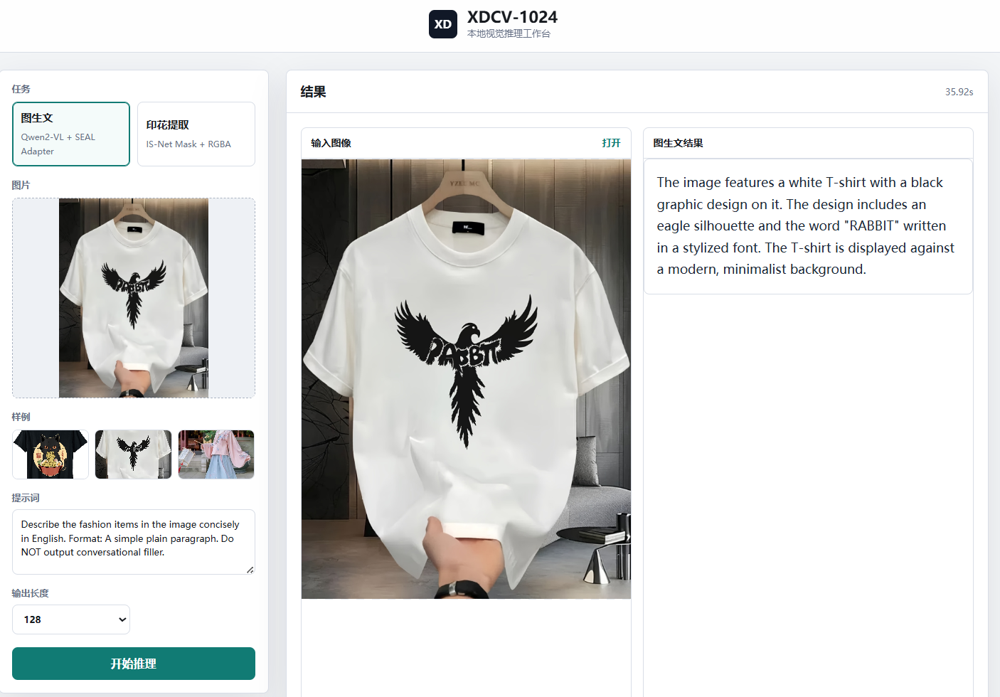

# XDCV-1024

本项目是一个本地视觉推理 demo 平台，包含两个功能：

- 图生文：Qwen2-VL-2B + 本地 SEAL LoRA adapter。
- 印花图像提取：IS-Net 生成灰度 mask，并输出 RGBA 印花抠图。

## 效果展示

| 印花图像提取 | 图生文推理 |
| --- | --- |
|  |  |

| 印花图像提取 | 图生文推理 |
| --- | --- |
|  |  |

## 目录

```text
image_caption_infer/   # 图生文推理脚本、adapter、依赖说明
itr_pe/                # 印花图像提取脚本、IS-Net 权重、依赖说明
xdcv_1024/             # 网页展示平台
demo/                  # 示例图片
```

## 启动网页平台

```bash
cd /home/xd/lj
source .fic/bin/activate
python xdcv_1024/server.py --host 127.0.0.1 --port 7860
```

浏览器访问：

```text
http://127.0.0.1:7860
```

公网访问请先阅读：

```text
xdcv_1024/README.md
```

## 权重文件

仓库包含大模型/推理权重时需要使用 Git LFS：

- `image_caption_infer/fixed_reward_seed2026_20260515_184503/adapter_model.safetensors`
- `itr_pe/weights/*.pth`

`.gitattributes` 已配置 `*.pth` 和 `*.safetensors` 走 Git LFS。
